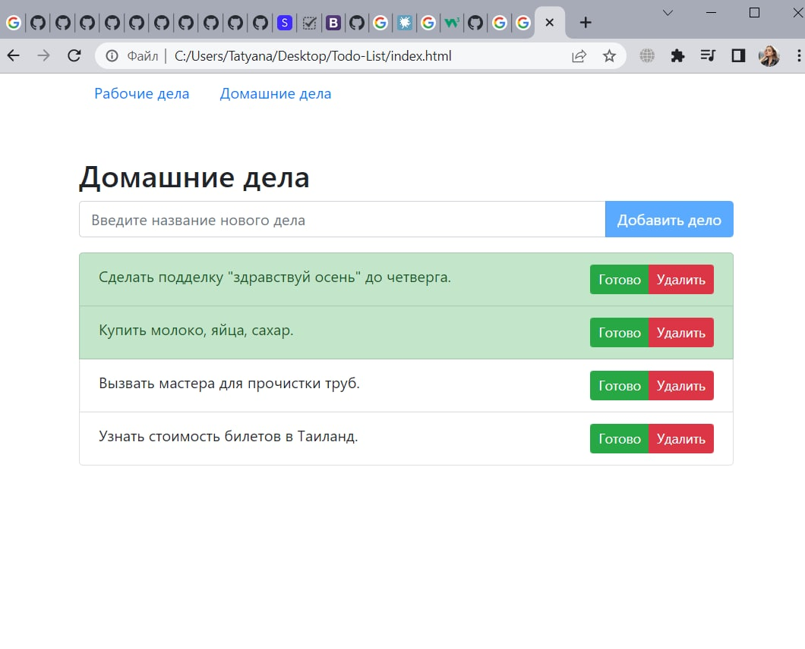

# Todo-List

#### JavaScript Todo List helps you create a list of things you want to do throughout the day.Whenever you complete this task, you can mark it. If the task has become irrelevant, you can delete it

### __[This project](https://tatyanarog.github.io/Todo-List/) is for js &amp; html practice. Used bootstrab library for styles creation.__
